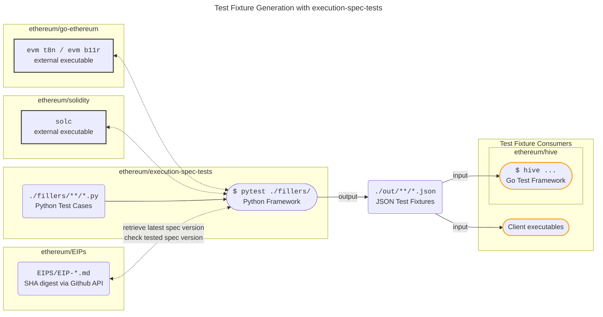

# Execution Spec Tests

[ethereum/execution-spec-tests](https://github.com/ethereum/execution-spec-tests) is both a collection of test cases and a framework to generate tests for Ethereum execution clients. The test cases, also known as _test fillers_, are implemented in Python.

The framework collects and executes the test cases in order to generate _test fixtures_ (JSON) which can be consumed by any execution client to verify their implementation of [ethereum/execution-specs](https://github.com/ethereum/execution-specs). Currently, the fixtures, which define state transition and block tests, are generated by the framework using the `t8n` and `b11r` commands from the [ethereum/go-ethereum](https://github.com/ethereum/go-ethereum) `evm` command-line tool. Other implementations of the `t8n` and `b11r` can be added in the future.




The generated test fixtures can be used:

1. Directly by client teams' test frameworks, and,
2. In the integration tests executed in the [ethereum/hive](https://github.com/ethereum/hive) framework.

# Getting Started

## Prerequisites

The following requires a Python 3.10 installation.

## Quick Start

This guide installs stable versions of the required external `evm` and `solc` executables and will only enable generation of test fixtures for features deployed to mainnet. In order to generate fixtures for features under active development, you can follow this guide and then follow the additional steps in [available in the online doc here](https://danceratopz.github.io/execution-spec-tests/getting_started/executing_tests_dev_fork/).

1. Ensure go-ethereum's `evm` tool and `solc` are in your path. Either build the required versions, or alternatively:

    ```console
    sudo add-apt-repository -y ppa:ethereum/ethereum
    sudo apt-get update
    sudo apt-get install ethereum solc
    ```
    More help:

    - [geth installation doc](https://geth.ethereum.org/docs/getting-started/installing-geth#ubuntu-via-ppas).
    - [solc installation doc](https://docs.soliditylang.org/en/latest/installing-solidity.html#linux-packages).

    Help for other platforms is available in the [online doc](https://danceratopz.github.io/execution-spec-tests/getting_started/quick_start/).

2. Clone the [execution-spec-tests](https://github.com/ethereum/execution-spec-tests) repo and install its and dependencies (it's recommended to use a virtual environment for the installation):
   ```console
   git clone https://github.com/ethereum/execution-spec-tests
   cd execution-spec-tests
   python3 -m venv ./venv/
   source ./venv/bin/activate
   pip install -e .[docs,lint,test]
   ```
3. Verify installation:
    1. Explore test cases:
       ```console
       pytest --collect-only
       ```
       Expected console output:
       <figure markdown>
         {align=center}
       </figure>
       
    2. Execute the test cases (verbosely) in the `./fillers/example/acl_example.py` module:
        ```console
        pytest -v fillers/example/acl_example.py
        ```
        Expected console output:
        <figure markdown>
          {align=center}
        </figure>
        Check:
       
        1. The versions of the `evm` and `solc` tools are as expected (your versions may differ from those in the highlighted box).
        2. The fixture file `out/example/acl_example/test_access_list.json` has been generated.

## Usage

See the [online documentation](https://danceratopz.github.io/execution-spec-tests/) for further help with working with this codebase:
1. Learn [useful command-line flags](https://danceratopz.github.io/execution-spec-tests/getting_started/executing_tests_command_line/).
2. [Execute tests for features under development](https://danceratopz.github.io/execution-spec-tests/getting_started/executing_tests_dev_fork/) via the `--latest-fork` flag.
3. _Optional:_ [Configure VS Code](https://danceratopz.github.io/execution-spec-tests/getting_started/setup_vs_code/) to auto-format Python code and [execute tests within VS Code](https://danceratopz.github.io/execution-spec-tests/getting_started/executing_tests_vs_code/#executing-and-debugging-test-cases).
4. Implement a new test case, see [Writing Tests](https://danceratopz.github.io/execution-spec-tests/writing_tests/).


## Contributing

Please see the [online documentation](https://danceratopz.github.io/execution-spec-tests/writing_tests/) for this repositories coding standards and help on how to implement new tests.

## License 

This project is licensed under the MIT License - see the [LICENSE](LICENSE) file for details.