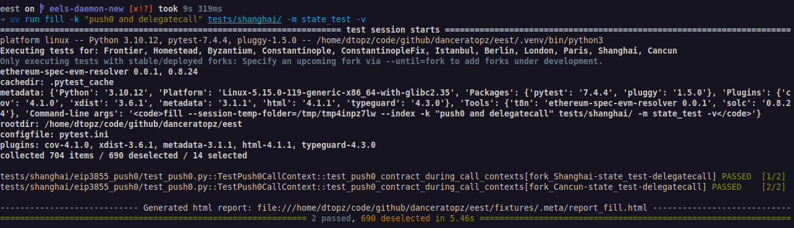

# Filling Tests for Features under Development

## Requirements

By default, the execution-testing framework only generates fixtures for forks that have been deployed to mainnet. In order to generate fixtures for evm features that are actively under development:

1. A version of the `evm` and `solc` tools that implement the feature must be available (although, typically only a developer version of the `evm` tool is required, usually the latest stable release of `solc` is adequate), and,
2. The development fork to test must be explicitly specified on the command-line:

    === "via the `--fork` flag"

          ```console
          uv run fill -k 4844 --fork=Cancun -v
          ```

    === "via the `--from` flag"

          ```console
          uv run fill -k 4844 --from=Cancun -v
          ```

    === "via the `--until` flag"

          ```console
          uv run fill -k 4844 --until=Cancun -v
          ```

!!! note "Specifying the `evm` binary via `evm-bin`"
     It is possible to explicitly specify the `evm` binary used to generate fixtures via the `--evm-bin` flag, for example,

     ```console
     uv run fill --fork=Cancun --evm-bin=/opt/bin/evm -v
     ```

## The Experimental `BinaryTree` Fork (EIP-8297)

`BinaryTree` is Amsterdam semantics with its state commitment replaced by the [EIP-8297](https://eips.ethereum.org/EIPS/eip-8297) Partitioned Binary Tree instead of the Merkle Patricia Trie. It is registered `deployed=False`, so only `--fork BinaryTree` reaches it.

```console
just binary-trie-fork [paths]
```

A bare invocation fills only the scoped `tests/binary_tree` suite; `just binary-trie-fork tests` instead reinterprets the entire `tests/` tree against `BinaryTree`.

When porting existing tests: `valid_from(...)` markers select `BinaryTree` (it subclasses `Amsterdam`), and `valid_at(...)` markers naming `Amsterdam` — or an EIP that resolves to it — select it too, because the fork is declared with `inherits_exact_fork_validity=True` (it keeps Amsterdam's execution semantics). Tests pinned to earlier forks (e.g. `valid_at("Prague")`) remain excluded, as do `valid_at_transition_to(...)` tests: no transition fork to `BinaryTree` exists.

## Further Help

1. [`geth`/`evm` build documentation](https://geth.ethereum.org/docs/getting-started/installing-geth#build-from-source).
2. [`solc` build documentation](https://docs.soliditylang.org/en/v0.8.20/installing-solidity.html#building-from-source).

!!! note "Verifying `evm` and `solc` versions used"
     The versions used to generate fixtures are displayed in the console output:
     <figure markdown>  <!-- markdownlint-disable MD033 (MD033=no-inline-html) -->
          {align=center}
     </figure>
