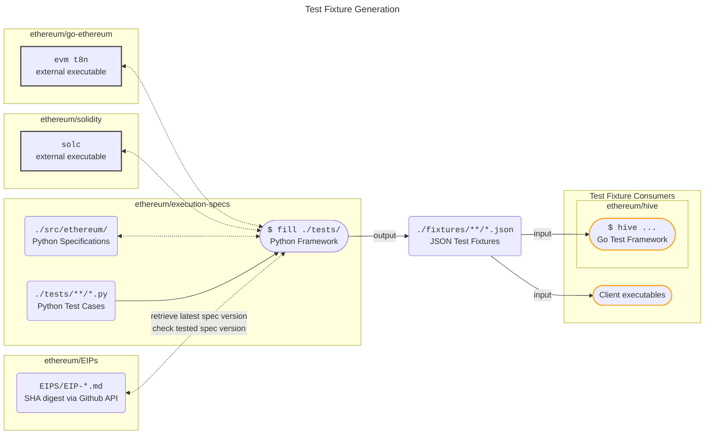

# Filling Tests

Execution of test cases against clients is a two-step process:

1. JSON test fixtures are generated from the Python test cases found in `./tests` using `fill` and an EVM transition tool (`t8n`) implementation.
2. Clients "consume" the JSON fixtures via either a dedicated, client-specific interface or a testing environment such as Hive.

The process of generating fixtures is often referred to as "filling" the tests.

!!! note "The `execute` command"

    The `execute` command directly executes Python test cases against a client via its RPC without using generated JSON fixtures. For all other methods of testing clients, the JSON fixtures are required. For more information, see [Executing Tests](../running_tests/execute/index.md).

## Transition Tools (`t8n`)

The `fill` command requires an EVM `t8n` tool provided by most clients in order to generate the JSON fixtures. The `t8n` tool is mainly responsible for calculating the post-state of the EVM after executing a transaction, most relevantly, it calculates the updated state root.

## Ethereum Execution Layer Specification (EELS)

By default, the [Ethereum Execution Layer Specification](https://github.com/ethereum/execution-specs) (EELS) reference implementation of the `t8n` tool is used to generate test fixtures for all forks that have been deployed to Ethereum mainnet. We strong encourage EIP authors to provide a reference implementation of their EIP in EELS, so that it can be used to generate test fixtures for features under active development.

## Limitations of Filling

The "fill-consume" method follows a differential testing approach: A reference implementation is used to generate JSON test fixtures, which can then be executed against other EVM clients. However:

!!! warning "Successfully filling does not guarantee correctness"

    Some tests cases, particularly those without straightforward post-checks, such as certain gas calculations, may allow subtle inconsistencies to slip through during filling.
    
    **Consequently, filling the tests does not ensure the client’s correctness. Clients must consume the tests to be considered correctly tested, even if that client was used to fill the tests.**

## Filling Static Tests from [ethereum/tests](https://github.com/ethereum/tests)

Filling static test fillers in YAML or JSON formats from [ethereum/tests](https://github.com/ethereum/tests/tree/develop/src) is possible by adding the `--fill-static-tests` to the `fill` command.

This functionality is only available for backwards compatibility and copying legacy tests from the [ethereum/tests](https://github.com/ethereum/tests) repository into this one.

Adding new static test fillers is otherwise not allowed.

<!--
## Overview

-->