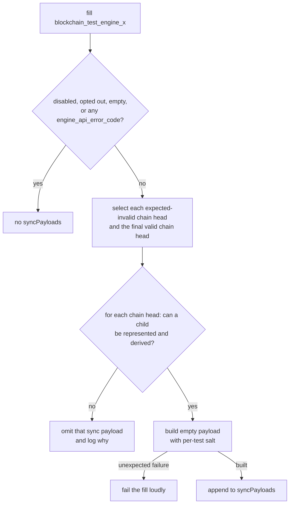

# Sync Payloads

When the filler produces a `blockchain_test_engine_x` fixture, it tries to append an empty sync payload to each chain represented in the test. These payloads are stored separately in the optional `syncPayloads` list. The test's `engineNewPayloads`, `lastblockhash`, and post-state assertion are unchanged. Consumers that replay the test blocks through the Engine API ignore `syncPayloads`.

For a linear valid chain there is one leaf and one sync payload:

```text
G → T₁ … Tₙ → S*
```

`G` is genesis, `T₁…Tₙ` are test payloads, `S` is the sync payload, and `*` marks the payload announced by a sync-based consumer. The `--no-sync-block` option disables all sync payloads; see the [command-line reference](./filling_tests_command_line.md#sync-payloads).

## Why there can be more than one

`engineNewPayloads` is a sequence of Engine API directives, not necessarily one linear chain. An expected-invalid payload does not advance the filler's canonical parent. If a valid payload follows it, the two payloads are siblings:

```text
       I! → Sᵢ*
G ─────┤
       T  → Sᵥ*
```

One announced sync payload has only one ancestry path, so it cannot cover both sibling chains. The filler appends one sync payload above `I` and another above `T`. More generally:

- Every expected-invalid test payload is a chain head and gets a sync payload.
- If the final test payload is valid, it ends the valid chain and gets the final sync payload.
- Earlier valid payloads need no additional sync payload because they are ancestors of a later chain head.

Sync payloads appear in test order, with the one above the final valid chain last. A consumer that reuses one client can therefore try the expected-invalid sibling chains before making the valid chain canonical. A consumer may instead use a fresh client for each sync payload.

## How a consumer finds each chain

Chain relationships come only from hashes. Timestamps select fork context; they do not identify ancestry. `lastblockhash` remains the final valid test block after all Engine API directives have been processed; it does not identify expected-invalid sibling chains.

For each entry in `syncPayloads`, a sync-based consumer:

1. Reads the sync payload's `parentHash`, which identifies its test-chain head.
2. Looks that hash up by `blockHash` in `engineNewPayloads`.
3. Follows `parentHash` links backwards until genesis.
4. Reverses that path and serves it with the sync payload appended.
5. Announces the sync payload with `engine_newPayload` and `forkchoiceUpdated`.

The client is expected to reject a reconstructed chain if it contains a test payload with `validationError`; otherwise it is expected to sync successfully. Across all sync payloads, every representable test payload occurs in at least one chain.

## Why announcing a sync payload starts syncing

When a client receives `engine_newPayload` for a sync payload, it does not yet have its parent. It can check only what needs no parent: encoding, block-hash consistency, and intrinsic field limits. If those checks pass, the client cannot form a verdict, so it answers `SYNCING` and fetches the ancestry over devp2p.

Above a valid chain, the client fetches and executes the test blocks and then executes the empty sync payload. Above an expected-invalid chain, the sync payload only triggers syncing: the client fetches the expected-invalid parent, rejects it, and consequently cannot execute its child. The sync payload's state root follows from a transition that no client will compute in that case.

In both cases, the sync payload must pass every check the client can perform without its parent's state. Otherwise, the client could reject the sync payload before fetching the test chain.

## Each sync payload gets a test-specific `blockHash`

Every sync payload's `extraData` contains a deterministic value derived from the test ID. This makes its `blockHash` depend on the test ID and prevents a reused client from skipping a sync because it has already seen an otherwise identical payload from another test. Sync payloads above different chain heads already have different `parentHash` values.

## An empty block is not a no-op

A sync payload has no transactions, but building and executing it is still a state transition. From Cancun on, every block performs mandatory system operations. From Amsterdam on, the block's own access list also consumes gas and sets the fork's minimum block gas limit.

This explains the exceptional cases. A test can leave system contracts in a state where another block cannot execute. A chain head can pin a gas limit below the next fork's floor, overflow a bounded child field, or make blob-fee arithmetic impractical. Above a valid chain the client executes the sync payload, so the filler must build a real block rather than invent a plausible-looking header.

## Fixtures or chain heads without sync payloads

The feature has three decision levels:

1. **An Engine API assertion omits the list for the whole fixture.** If any test block sets `engine_api_error_code`, the fixture has no `syncPayloads`. That test checks the client's response when the test payload itself is announced. Announcing a sync payload instead would bypass that assertion.
2. **The framework decides for each chain head.** The framework omits a sync payload when no child can be represented or derived: timestamp or slot-number exhaustion, a gas limit below the child fork's minimum, blob fields that overflow `uint64`, or an excess blob gas whose EIP-7918 price calculation would not finish. Other sibling-chain heads can still get sync payloads.
3. **A test can opt the whole fixture out.** Shared test generators that deliberately leave mandatory system contracts unusable pass `sync_block=False`.

A release fill can disable the feature globally with `--no-sync-block`.

When the framework cannot append a sync payload, it logs the reason. If it decides that a sync payload can be built but construction then fails, the fill fails and names `sync_block=False` as the explicit opt-out. This feature never skips the fixture itself.

## How the filler decides


