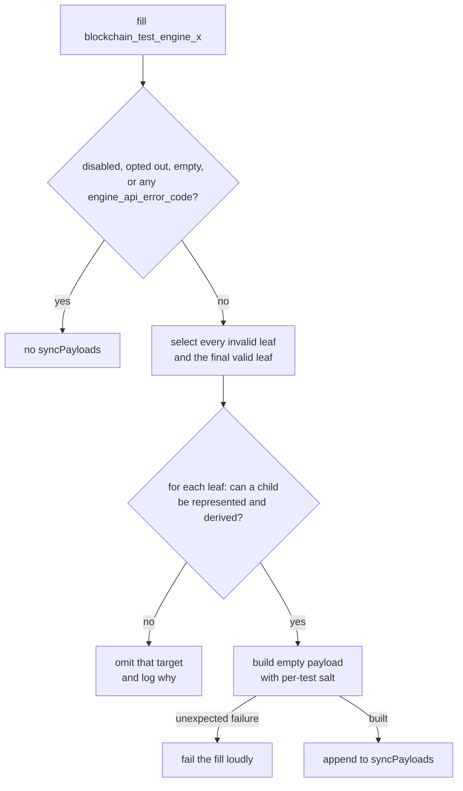

# Sync Payloads

When the filler produces a `blockchain_test_engine_x` fixture, it can add framework-built empty blocks above the leaves of the test's authored payload graph. These blocks are stored out of chain in the optional `syncPayloads` list. They do not change `engineNewPayloads`, `lastblockhash`, or the post-state assertion, and consumers that replay the authored directives through the Engine API ignore them.

For a linear valid chain there is one leaf and one sync payload:

```text
G → T₁ … Tₙ → S*
```

`G` is genesis, `T₁…Tₙ` are authored payloads, `S` is framework scaffolding, and `*` marks the head announced by a sync-based consumer. The `--no-sync-block` option disables all sync payloads; see the [command-line reference](./filling_tests_command_line.md#sync-payloads).

## Why there can be more than one

`engineNewPayloads` is a sequence of Engine API directives, not necessarily one linear chain. An expected-invalid payload does not advance the filler's canonical parent. If a valid payload follows it, the two payloads are siblings:

```text
       I! → Sᵢ*
G ─────┤
       T  → Sᵥ*
```

One announced head has only one ancestry path, so it cannot cover both leaves. The filler adds one target above `I` and another above `T`. More generally:

- every expected-invalid authored payload is a leaf and gets a target;
- if the final authored payload is valid, it is the canonical leaf and gets the final target;
- earlier valid payloads need no target of their own because they are ancestors of a later leaf.

Targets appear in authored order, with the final valid target last. A consumer that reuses one client can therefore attempt rejected branches before making the valid branch canonical. A consumer may instead use a fresh client for each target.

## How a consumer finds each branch

Topology comes only from hashes. Timestamps select fork context; they do not identify ancestry. `lastblockhash` remains the final valid authored head after all Engine API directives have been processed; it does not enumerate rejected branches.

For each entry in `syncPayloads`, a sync-based consumer:

1. reads the target's `parentHash`, which names its authored leaf;
2. looks that hash up by `blockHash` in `engineNewPayloads`;
3. follows `parentHash` links backwards until genesis;
4. reverses that path and serves it with the sync payload appended;
5. announces the sync payload with `engine_newPayload` and `forkchoiceUpdated`.

The reconstructed path is expected to be rejected if it contains an authored payload with `validationError`; otherwise it is expected to sync successfully. Across all targets, every representable authored payload must occur in at least one path.

## Why announcing a target starts sync

When a client receives `engine_newPayload` for a sync payload, it does not yet have its parent. It can check only what needs no parent: encoding, block-hash consistency, and intrinsic field limits. If those checks pass, the client cannot form a verdict, so it answers `SYNCING` and fetches the ancestry over devp2p.

Above a valid leaf, the client fetches and executes the ancestry and then executes the empty target itself. Above an invalid leaf, the target is only an announcement device: the client fetches the invalid parent, rejects it, and consequently rejects the target as its descendant. Nobody executes the target in that case. Its state root follows from a transition no client will compute.

Both cases depend on one contract: **nothing checkable without the parent may be wrong with a sync payload**. Otherwise the client could reject the framework's scaffolding without fetching the authored branch.

## Each test gets distinct targets

Every sync payload carries a digest of the test's node ID in `extra_data`. Two tests in one pre-allocation group may author byte-identical payload graphs, and a reused client only starts sync for a head it has never seen. The per-test salt prevents one test from inheriting another test's cached head or rejection. Targets for different leaves are already distinct because their parent hashes differ.

## An empty block is not a no-op

A sync payload has no transactions, but building and executing it is still a state transition. From Cancun on, every block performs mandatory system operations. From Amsterdam on, the block's own access list also consumes gas and sets the fork's minimum block gas limit.

This explains the exceptional cases. A test can leave system contracts in a state where another block cannot execute. A leaf can pin a gas limit below the next fork's floor, overflow a bounded child field, or make blob-fee arithmetic impractical. Above a valid leaf the client genuinely executes the target, so the filler must build a real block rather than invent a plausible-looking header.

## Fixtures or leaves without targets

The feature has three decision levels:

1. **The test assertion decides for the whole fixture.** If any authored block asserts an `engine_api_error_code`, the fixture has no `syncPayloads`. That test is about the response to announcing the authored payload itself; announcing scaffolding instead would remove the assertion.
2. **The filler decides per leaf.** A leaf gets no target when no child can be represented or derived: timestamp or slot-number exhaustion, a gas limit below the child fork's minimum, blob fields that overflow `uint64`, or an excess blob gas whose EIP-7918 price calculation would not finish. Other leaves can still carry targets.
3. **The test opts the whole fixture out.** A test that deliberately leaves mandatory system contracts unusable passes `sync_block=False`. A release fill can do the same globally with `--no-sync-block`.

An unavailable target is logged. Anything unexpected while constructing a target fails the fill loudly and names `sync_block=False` as the explicit opt-out; the filler never silently swallows a construction failure. The fixture itself is never skipped by this feature.

## How the filler decides


