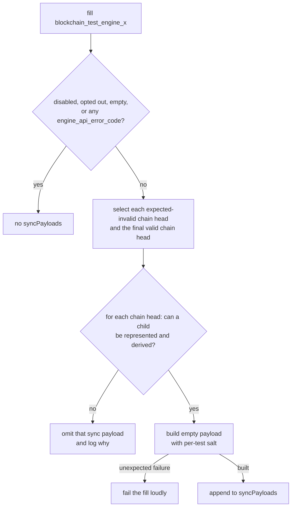

# Sync Payloads

When the filler produces a `blockchain_test_engine_x` fixture, it tries to append an empty sync payload to each eligible test chain. This lets system-test consumers deliver every test payload to a client over devp2p. Sync payloads are stored separately in the optional `syncPayloads` list. The test's `engineNewPayloads`, `lastblockhash`, and post-state assertion are unchanged. Fixture metadata derived from the complete serialized fixture, including `_info.hash`, changes when `syncPayloads` is present. Engine API consumers can safely ignore `syncPayloads`.

For the common case, a linear valid chain, the fixture contains one sync payload:

```text
G → T₁ … Tₙ → S*
```

Here, `G` is genesis, `T₁…Tₙ` are test payloads, `S` is the sync payload, and `*` marks the payload announced by a devp2p full-sync consumer. The `--no-sync-block` option disables all sync payloads; see the [command-line reference](./filling_tests_command_line.md#sync-payloads).

## Why an additional sync payload is required

**TL;DR:** An additional synthetic sync payload ensures that every test payload is covered by devp2p full-sync testing.

This is especially important because most test cases contain a single-block chain. If the simulator delivered the only test payload through `engine_newPayload`, its parent would be the already-known genesis block. The client could validate the payload directly, so there would be no missing ancestry and no synchronization to start. Appending a sync payload above the test payload makes the test payload the sync payload's parent. A client that does not already know it must obtain it through devp2p.

However, multi-block test cases also require a sync payload. Delivering the final test payload through `engine_newPayload` can start synchronization when its parent is unknown, but it does not guarantee that the final test payload travels over devp2p.

This follows normal mainnet behavior. An execution client may receive an execution payload from the consensus layer before it has the payload's parent. It cannot fully validate the payload until it obtains the missing ancestry. If its initial checks pass, the client responds `SYNCING` and uses its normal devp2p synchronization process to obtain that ancestry.

Client behavior diverges at this point. Some clients request the announced payload's body over devp2p together with its missing ancestors. Other clients request only the ancestors because the announced payload's body was already supplied through `engine_newPayload`. For those clients, the announced payload never travels over devp2p. Avoiding that redundant request is a valid client-side optimization, so the fixture cannot rely on the first behavior.

The fixture accommodates both behaviors by appending and announcing an additional sync payload. This makes the final test payload part of the missing ancestry, ensuring that every test payload is covered by devp2p full-sync testing.

## Each sync payload is salted to ensure uniqueness

Test cases are intended to be unique, but complex parametrization can sometimes produce cases with byte-identical payload graphs. Avoiding these duplicates is a fill-side or test-author concern. While a test case remains in the fixture set, however, consumers must still be able to run its devp2p full-sync test.

The filler therefore places a deterministic value derived from the test ID in every sync payload's `extraData`. This gives the sync payload a test-specific `blockHash`, even when another test case has an identical chain. A reused client cannot mistake it for a sync payload it has already processed and skip the test. Sync payloads above different chain heads are already distinct because their `parentHash` values differ.

## Tests with sibling chains require multiple sync payloads

`engineNewPayloads` is a sequence of Engine API directives, not necessarily one linear chain. An expected-invalid payload does not advance the filler's canonical parent. If a valid payload follows it, the two payloads are siblings:

```text
       I! → Sᵢ*
G ─────┤
       T  → Sᵥ*
```

One announced sync payload has only one ancestry path, so it cannot cover both sibling chains. The filler appends one sync payload above `I` and another above `T`. More generally:

- Every expected-invalid test payload is a chain head and gets a sync payload.
- If the final test payload is valid, it ends the valid chain and gets the final sync payload.
- Earlier valid payloads need no additional sync payload because they are ancestors of a later chain head.

Sync payloads appear in test order, with the one above the final valid chain last. A consumer that reuses one client can therefore try the expected-invalid sibling chains before making the valid chain canonical. A consumer may instead use a fresh client for each sync payload.

## A sync payload contains no transactions but still requires a state transition

A sync payload has no transactions, but building and executing it still requires a state transition. Whether it can trigger synchronization depends on when the client can detect a problem:

| Situation | When the client detects it | Result |
| -- | -- | -- |
| The sync payload itself fails a check that does not require its parent | Immediately | The client rejects it without requesting the ancestry. |
| The sync payload passes its initial checks, but an ancestor is invalid | After fetching the ancestry | The client first starts syncing, then rejects the invalid ancestor and never executes the sync payload. |
| The sync payload and its ancestry are valid | After fetching the ancestry | The client executes the test chain and then the sync payload. |

A sync payload above a valid chain must therefore describe a real state transition. From Cancun on, every block performs mandatory system operations. From Amsterdam on, the block's own access list also consumes gas and sets the fork's minimum block gas limit. Above an expected-invalid chain, the sync payload only needs to pass the checks available before the ancestry is fetched. Its parent will later be rejected, so the sync payload itself will never be executed. Its state root follows from a transition that no client will compute.

These validation and execution requirements account for some of the omissions described in the next section.

## Why sync payloads are sometimes omitted

The filler appends a sync payload only when it can produce the behavior required for that chain head. A payload that the client can reject immediately because of its encoding, block-hash consistency, or intrinsic field limits would not trigger synchronization and therefore adds no devp2p coverage. Above a valid chain, a payload that cannot be executed would not provide a successful synchronization endpoint.

These constraints explain some exceptional cases. A test can leave system contracts in a state where another block cannot execute. A chain head can pin a gas limit below the next fork's floor, overflow a bounded child field, or make blob-fee arithmetic impractical. In these known cases, the filler omits the sync payload. Other omissions preserve the test author's intent or disable the feature.

The filler decides whether to append sync payloads at three levels:

1. **An Engine API assertion omits the list for the whole fixture.** If any test block sets `engine_api_error_code`, the fixture has no `syncPayloads`. That test checks the client's response when the test payload itself is announced. Announcing a sync payload instead would bypass that assertion.
2. **The framework decides for each chain head.** The framework omits a sync payload when no child can be represented or derived: timestamp or slot-number exhaustion, a gas limit below the child fork's minimum, blob fields that overflow `uint64`, or an excess blob gas whose EIP-7918 price calculation would not finish. Other sibling-chain heads can still get sync payloads.
3. **A test can opt the whole fixture out.** Shared test generators that deliberately leave mandatory system contracts unusable pass `sync_block=False`.

A release fill can disable the feature globally with `--no-sync-block`.

When the framework cannot append a sync payload, it logs the reason. If it decides that a sync payload can be built but construction then fails, the fill fails and reports the underlying error. This should first be treated as a framework coverage gap: sync-payload construction should be extended and regression coverage added rather than disabling devp2p coverage with `sync_block=False`. The opt-out is intended only for tests whose purpose deliberately leaves a terminal context in which no child block can execute. This feature never skips the fixture itself.

### Filler decision flow



See [Blockchain Engine X Test consumption](../running_tests/test_formats/blockchain_test_engine_x.md#consumption) for the Engine API and devp2p full-sync consumption paths.

## The `blockchain_test_sync` format also uses the sync-payload builder

The [`blockchain_test_sync`](../running_tests/test_formats/blockchain_test_sync.md) format is filled only for tests marked `verify_sync` and is consumed by `consume sync`, which runs two clients. The client under test receives every test payload through `engine_newPayload`. A sync client must then obtain the whole chain from it over devp2p, and the fixture's single `syncPayload` field holds the payload announced to the sync client to trigger that synchronization.

This payload comes from the same builder as the `syncPayloads` entries above, salt included. The rules differ because the field's role differs:

1. The format supports only valid linear chains, so the payload graph has exactly one leaf, the final test payload, and the single `syncPayload` announces it. The fill rejects test cases containing expected-invalid payloads or Engine API error-code assertions.
2. The payload is built regardless of `--no-sync-block` and of a test's `sync_block=False`. Those govern the engine X format's optional list; a sync fixture without its payload could not serve its consumer.
3. A chain head that the framework cannot build a payload above fails the fill with an error naming the reason, instead of filling bare.
