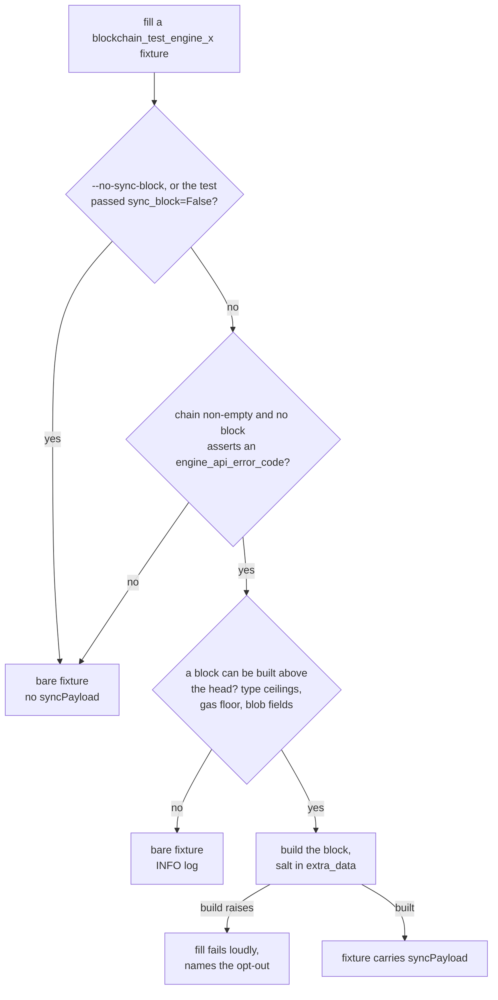

# The Sync Block

When the filler produces a `blockchain_test_engine_x` fixture, it builds one empty block above the chain's last block and stores it out of chain, in the fixture's `syncPayload` field. The test's own fixture does not change at all: `engineNewPayloads`, `lastblockhash` and the post state stay byte for byte what the test author wrote. Consumers that replay payloads through the Engine API can ignore the field entirely.

```text
G → T₁ … Tₙ → S*
```

`G` is genesis, `T₁…Tₙ` are the test's own blocks, `S` is the sync block, and `*` marks the block a sync-based consumer announces. This page explains why the block exists, what it must get right, and which chains do not get one. The `--no-sync-block` option that disables it is documented with the other [command-line options](./filling_tests_command_line.md#the-sync-block).

## Two blocks to keep apart

- **Tₙ**, the chain's head, is the subject of the test. The test's assertion is always about how a client judges the author's blocks.
- **S** is framework scaffolding. It exists so that every block the author wrote, the head included, sits *below* the announced head and must therefore travel devp2p. No test asserts anything about `S` itself.

`S` carries a per-test value in its `extra_data` (a digest of the test's node id). Two tests in one pre-allocation group may declare byte-identical chains, and a client that is reused across the group only starts a sync for a head it has never seen. Without the salt the second test's sync block would be byte-identical to the first's: announcing it would trigger no sync at all, and the client would answer from whatever the first test left in its database - a verdict that belongs to the previous test, remembered rather than earned, and on an invalid chain a cached rejection. The salt keeps every announced head unique to its test, so every test exercises the announce, sync and verdict cycle itself.

## Why announcing the sync block makes a client sync

When a client receives `engine_newPayload` for `S`, it does not have `Tₙ`. It can only check what needs no parent: the encoding, the block hash's consistency with the header, and intrinsic field limits. If all of that passes and the parent is unknown, the client cannot form a verdict yet, so it answers `SYNCING` and asks its sync machinery to fetch the ancestry over devp2p. This is the same for every chain, valid or not.

For a **valid chain**, the common case, that is the whole story: the client fetches every block the author wrote, executes them through its sync path, executes `S` on top, and answers `VALID`. Here `S` is simply the head of a valid chain, so it must be a genuinely valid block: the client executes it as part of a chain it must accept.

For an **invalid chain** the same mechanism carries the rejection. If `Tₙ` is invalid then `S` is invalid too, because its parent is bad. But that fact is invisible in `S` itself: every check a client can run without the parent passes. So the client answers `SYNCING`, fetches `Tₙ` over devp2p, rejects it in its sync path, and marks `S` invalid as its descendant. The verdict for the announced head becomes `INVALID` with `latestValidHash` naming the last valid ancestor. Nobody ever executes `S` in this case. Its state root follows from a state transition no client would compute, and no check that runs without the parent's state can see that.

Both cases rest on one contract: **nothing checkable in isolation may be wrong with the sync block**. A block that is invalid only through its ancestry still works as an announced head, because the invalidity is discovered exactly the way the test wants: by syncing. A block that is wrong in itself does not, which is the next section's subject.

## An empty block is not a no-op

The sync block carries no transactions, but building and executing it is still a real state transition. From Cancun on, every block performs mandatory system operations regardless of its transaction list: the EIP-4788 beacon-root write; from Prague, the EIP-7002 withdrawal-request and EIP-7251 consolidation-request system calls; from Amsterdam, the block's own access list, which itself costs gas and sets the fork's minimum gas limit.

This single fact explains most of the cases below. A chain that sabotages a system contract leaves behind a state on which the "empty" block cannot execute. A head whose gas limit is below what the empty block's own access list needs cannot carry it. And above a valid chain the client genuinely executes the sync block, so `VALID` for the announced head covers its execution too.

## Chains that get no sync block

Some fixtures ship without a `syncPayload`. A bare fixture is never a skipped test: it fills as exactly the author's chain, and a sync-based consumer announces that chain's own head instead. There are three kinds, told apart by who decides:

1. **The test's assertion decides.** A chain asserting an `engine_api_error_code` tests the client's answer to the announcement of the test's *own* payload. Announcing a block above it would take that assertion away, so nothing may be appended. This is part of what the field means, not a physical limit: such a fill would succeed while silently destroying the test.
2. **The filler decides.** Some heads admit no block above them at all, and every such bound is arithmetic the filler can check directly: a timestamp or slot number so close to the uint64 ceiling that no child value exists (both fields are semantic and are never clamped or shifted), a gas limit below the fork's minimum (the sync block inherits its parent's gas limit), blob gas fields that do not sum within uint64, and, from Osaka on, an excess blob gas whose [EIP-7918](https://eips.ethereum.org/EIPS/eip-7918) price series would never finish. Only an intentionally invalid head can pin the fork-arithmetic values; the type ceilings can also be reached by valid tests that probe exactly those boundaries. The filler declines with an INFO log. Test authors are never asked to record these conditions, because the bounds change with the forks and markers recording them would go stale.
3. **The test declares it.** A chain can deliberately leave behind a state the sync block cannot *execute* on: a sabotaged system contract that every block must call, or a fork transition ending with a system contract still undeployed. Unlike the header bounds above, this is only discoverable by executing the block. The test opts out by passing `sync_block=False` where the chain is built; the system-contract test generators do exactly this.

Anything else that stops the build fails the fill loudly, with the opt-out named in the error and the real cause chained. Nothing is ever silently dropped. Benchmark chains carry the block like any other chain: their gas and opcode measurements are recorded before the block is built, and the block is what lets a sync-based consumer serve them at all. A benchmark release that needs to exclude it can fill with `--no-sync-block`.

## Why the filler never fakes a block

For the filler-decided cases there is nothing to build: the only block builder in the fill is the fork's own arithmetic, and on those heads it raises, overflows, or never finishes. The filler could in principle bypass it and hand-craft a header, and it deliberately does not:

1. A hand-crafted block in these cases is wrong in ways a client checks at the door. A timestamp past uint64 cannot even be encoded; a gas limit below the protocol floor fails an intrinsic header check. The client refuses the announcement instead of answering `SYNCING`, so the author's blocks never travel and nothing is gained.
2. Worse, the test could pass for the wrong reason. A rejection test polls the announced head for `INVALID`; a client rejecting the framework's broken scaffolding produces exactly that answer without ever seeing the test's own block. A bare fixture is strictly more honest: the client's verdict lands on the block the test is about.

The rule that ties this together: **the announced block must be the block whose judgment the test asserts.** Announcing an intrinsically invalid block is fine when rejecting it is the test's point (a bare invalid chain announces its own head); it is not when the block is scaffolding, because the rejection would then hide whether the client ever judged the test's block.

## How the filler decides



On the fill side there are exactly three outcomes: a fixture with the block, a bare fixture, or a loud fill error. The fill never skips a fixture for this feature; the consume side decides what a bare fixture's announcement can still claim.
