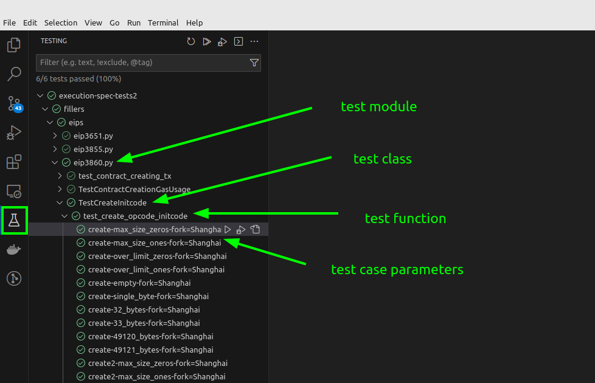

# Executing Tests in VS Code

Prerequisite: [VS Code Setup](./setup_vs_code.md).

## Exploring Test Cases

<figure markdown>
 { width=auto align=right}
</figure>

## Executing Test Cases

## Debugging Test Cases