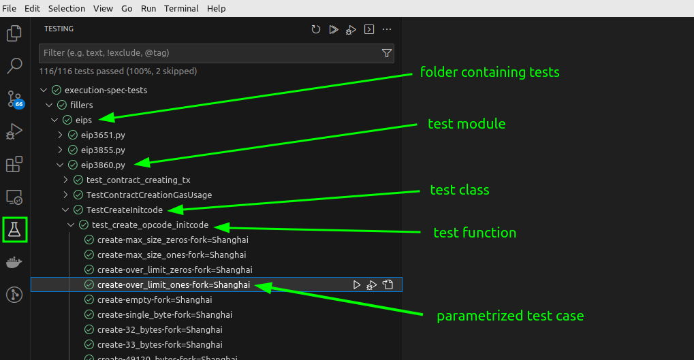
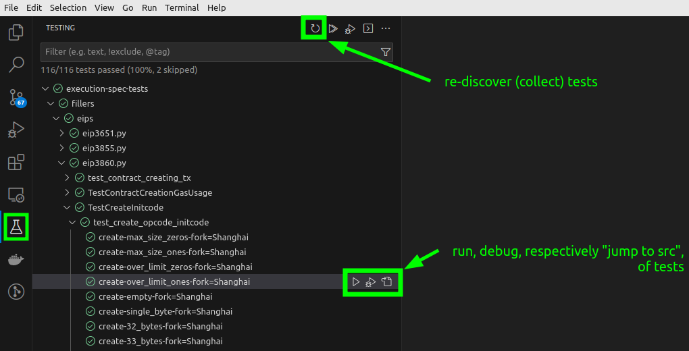

# Executing Tests in VS Code

Prerequisite: [VS Code Setup](./setup_vs_code.md).

## Exploring Test Cases

Implemented test cases can be explored in VS Code's "Testing" View; click on the conical flask highlighted in the screenshot below.

<figure markdown>
 { width=auto align=center}
</figure>

!!! note "Testing EVM Features Under Active Development"
     See [the VS Code section](./executing_tests_dev_fork.md#executing-tests-for-features-under-development) in [Executing Tests for Features under Development](./executing_tests_dev_fork.md) to explore tests targeting EVM features under development.

## Executing and Debugging Test Cases

<figure markdown>
 { width=auto align=center}
</figure>
