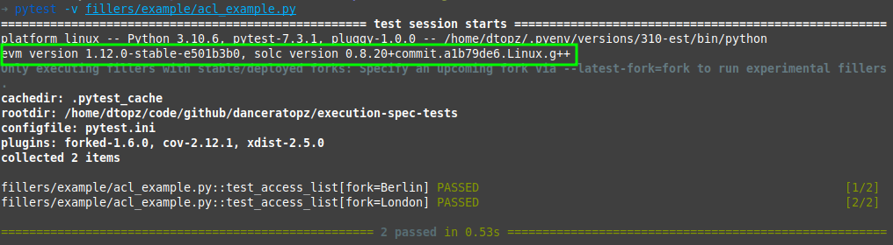

# Quick Start


!!! info "Deployed forks vs forks under active development"
    The EVM features under test must be implemented in the `evm` tool and `solc` executables that are used by execution-spec-tests. The following installs stable versions of these tools. 

    To test features under active development, start with this base configuration and then follow the steps in [executing tests for features under development](./executing_tests_dev_fork.md). 


The following requires a Python 3.10 installation.

1. Ensure go-ethereum's `evm` tool and `solc` are in your path. Either build the required versions, or alternatively:

    === "Ubuntu"

          ```console
          sudo add-apt-repository -y ppa:ethereum/ethereum
          sudo apt-get update
          sudo apt-get install ethereum solc
          ```
          More help:

          - [geth installation doc](https://geth.ethereum.org/docs/getting-started/installing-geth#ubuntu-via-ppas).
          - [solc installation doc](https://docs.soliditylang.org/en/latest/installing-solidity.html#linux-packages).

    === "macos"

          ```console
          brew update
          brew upgrade
          brew tap ethereum/ethereum
          brew install ethereum solidity
          ```
          More help:

          - [geth installation doc](https://geth.ethereum.org/docs/getting-started/installing-geth#macos-via-homebrew).
          - [solc installation doc](https://docs.soliditylang.org/en/latest/installing-solidity.html#macos-packages).

    === "Windows"

          Binaries available here:

          - [geth](https://geth.ethereum.org/downloads) (binary or installer).
          - [solc](https://github.com/ethereum/solidity/releases).

          More help:

          - [geth installation doc](https://geth.ethereum.org/docs/getting-started/installing-geth#windows).
          - [solc static binaries doc](https://docs.soliditylang.org/en/latest/installing-solidity.html#static-binaries).
          

2. Clone the [execution-spec-tests](https://github.com/ethereum/execution-spec-tests) repo and install its and dependencies (it's recommended to use a virtual environment for the installation):
   ```console
   git clone https://github.com/ethereum/execution-spec-tests
   cd execution-spec-tests
   python3 -m venv ./venv/
   source ./venv/bin/activate
   pip install -e .[docs,lint,test]
   ```
3. Verify installation:
    1. Explore test cases:
       ```console
       pytest --collect-only
       ```
       Expected console output:
       <figure markdown>
         {align=center}
       </figure>
       
    2. Execute the test cases (verbosely) in the `./fillers/example/acl_example.py` module:
        ```console
        pytest -v fillers/example/acl_example.py
        ```
        Expected console output:
        <figure markdown>
          {align=center}
        </figure>
        Check:
       
        1. The versions of the `evm` and `solc` tools are as expected (the versions may differ from those in the highlighted box).
        2. The fixture file `out/example/acl_example/test_access_list.json` has been generated.

## Optional Next Steps:

1. Learn [useful command-line flags](./executing_tests_command_line.md).
2. [Configure VS Code](./setup_vs_code.md) to auto-format and lint your Python code.
3. [Execute tests in VS Code's debugger](./executing_tests_vs_code.md#executing-and-debugging-test-cases).
4. Implement tests cases in an appropriate `fillers/` sub-directory and Python module, see [Writing Tests](../writing_tests/index.md).
5. [Execute tests for features under development](./executing_tests_dev_fork.md) via the `--latest-fork` flag.
6. [Run checks](../writing_tests/verifying_changes.md) (lint, spell-check, type-check, tests, docs):
   ```console
   tox -e fillers
   ```
   If `tox` congratulates you, Github actions CI/CD should pass upon pushing to remote.
7. Take a deep dive in to test writing:

    - Tutorial: [Writing a State Test](../tutorials/state_transition.md).
    - Tutorial: [Writing a Blockchain Test](../tutorials/blockchain.md).