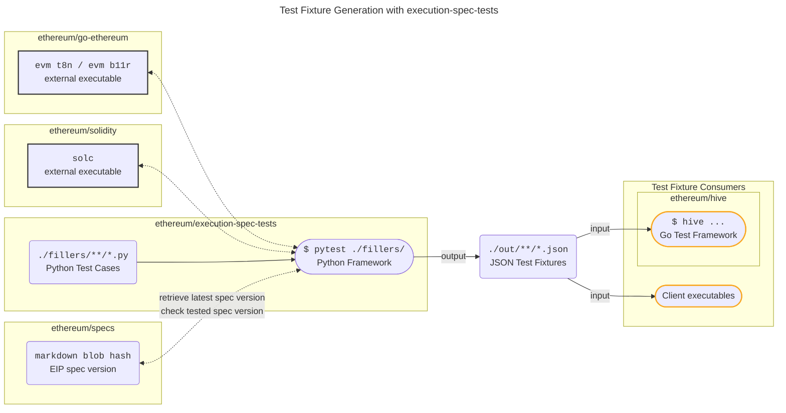

# Execution Spec Tests

<figure markdown>
 { width="200" align=right}
</figure>

## Overview

[ethereum/execution-spec-tests](https://github.com/ethereum/execution-spec-tests) is both a collection of test cases and a framework to generate tests for Ethereum execution clients. The test cases, also known as _test fillers_, are implemented in Python.

The framework collects and executes the test cases in order to generate _test fixtures_ (JSON) which can be consumed by any execution client to verify their implementation of [ethereum/execution-specs](https://github.com/ethereum/execution-specs). Currently, the fixtures, which define state transition and block tests, are generated by the framework using the `t8n` and `b11r` commands from the [ethereum/go-ethereum](https://github.com/ethereum/go-ethereum) `evm` command-line tool. Other implementations of the `t8n` and `b11r` can be added in the future.

The generated test fixtures can be used:

1. Directly by client teams' test frameworks, and,
2. In the integration tests executed in the [ethereum/hive](https://github.com/ethereum/hive) framework.

## Relationship to ethereum/tests

This collection of tests is relatively new (test case development started Q4, 2022) and mainly targets recent and upcoming Ethereum specification changes. It does not replace, but rather complements the existing tests in [ethereum/tests](https://github.com/ethereum/tests).

## Motivation

The motivation to implement test cases in [ethereum/execution-spec-tests](https://github.com/ethereum/execution-spec-tests) is:

1. To implement test cases as code and ensure that changes, due to spec changes, for example, can be easily made. Moreover, changes are easily understandable and available in version control.
2. To avoid the 2-step approach often used in [ethereum/tests](https://github.com/ethereum/tests):
    1. Code (often unavailable) -> Test case (YAML).
    2. Test case (YAML) -> Fixtures (JSON).

!!! success "Contributing" 
    Contributions via [PR](https://github.com/ethereum/execution-spec-tests/pulls) are welcome!

