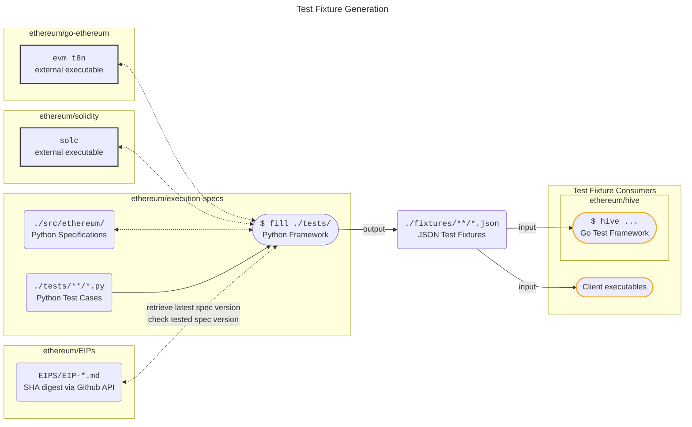

# Ethereum Execution Layer Specifications and Tests

Welcome to the documentation for [ethereum/execution-specs](https://github.com/ethereum/execution-specs) -- the Python reference specifications and test suite for the Ethereum execution layer.

## Where to Start

- :material-download-outline: **Getting Started**

    ---

    New here? Install the repository and run your first command.

    *First time user.*

    [:octicons-arrow-right-24: Installation](getting_started/installation.md)

- :material-file-code-outline: **Writing Specs**

    ---

    Implement an EIP as an executable Python specification.

    *For EIP authors and researchers.*

    [:octicons-arrow-right-24: Get started](writing_specs/index.md)

- :material-test-tube: **Writing Tests**

    ---

    Write test cases that verify EIP implementations across clients.

    *For EIP authors and test devs.*

    [:octicons-arrow-right-24: Get started](writing_tests/index.md)

- :material-play-circle-outline: **Running Tests**

    ---

    Generate JSON fixtures or run tests against an execution layer client.

    *For client developers.*

    [:octicons-arrow-right-24: Overview](running_tests/index.md)

- :material-book-open-variant: **Read the Specs**

    ---

    Browse the rendered Python specifications for the current fork and EIP.

    [:octicons-arrow-right-24: Specifications](spec/)

- :material-format-list-checks: **Test Case Reference**

    ---

    Browse all test cases organized by fork and EIP.

    [:octicons-arrow-right-24: Browse tests](tests/)

## Overview

```mermaid
---
title: Test Fixture Generation
---
flowchart LR
  style C stroke:#333,stroke-width:2px
  style D stroke:#333,stroke-width:2px
  style G stroke:#F9A825,stroke-width:2px
  style H stroke:#F9A825,stroke-width:2px

  subgraph ethereum/go-ethereum
    C[<code>evm t8n</code><br/>external executable]
  end

  subgraph ethereum/solidity
    D[<code>solc</code><br/>external executable]
  end

  subgraph ethereum/EIPs
    E(<code>EIPS/EIP-*.md</code><br/>SHA digest via Github API)
  end

  subgraph "ethereum/execution-specs"
    A(<code>./tests/**/*.py</code><br/>Python Test Cases)
    B([<code>$ fill ./tests/</code><br/>Python Framework])
    S(<code>./src/ethereum/</code><br/>Python Specifications)
  end

  subgraph Test Fixture Consumers
    subgraph ethereum/hive
      G([<code>$ hive ...</code><br/>Go Test Framework])
    end
    H([Client executables])
  end

  C <-.-> B
  D <-.-> B
  S <-.-> B
  A --> B
  E <-.-> |retrieve latest spec version\ncheck tested spec version| B
  B -->|output| F(<code>./fixtures/**/*.json</code>\nJSON Test Fixtures)
  F -->|input| G
  F -->|input| H
```

!!! bug "Reporting a Vulnerability"

    Care is required when adding PRs or issues for functionality that is live on Ethereum mainnet. Please report vulnerabilities and verify bounty eligibility via the [bug bounty program](https://bounty.ethereum.org).

    - **Please do not create a PR with a vulnerability visible.**
    - **Please do not file a public ticket mentioning the vulnerability.**
