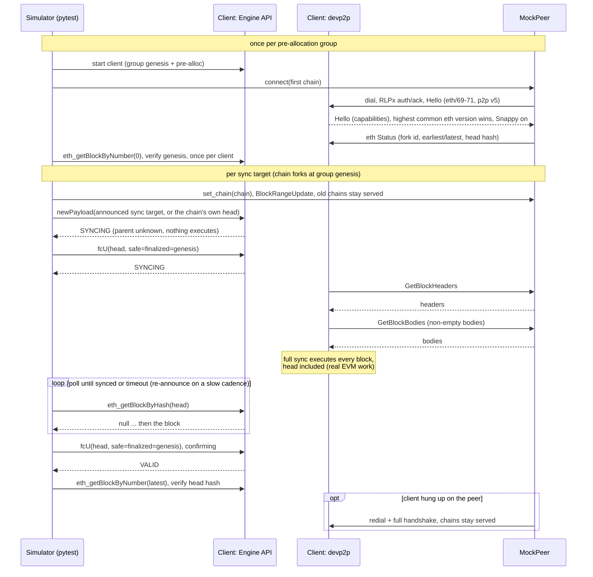

# Consume WireX

The WireX simulator (`eels/consume-wirex`) makes the client under test full sync each test's chain from a deterministic mock devp2p peer implemented inside the testing framework.

The intent is to verify that clients can receive and propagate blocks over devp2p using the consensus test corpus; it is not intended to be a complete test of historical sync. WireX intends to replace [`consume rlp`](../running.md#rlp) for post-Merge forks: instead of loading RLP-encoded blocks through a client-specific offline import mode at startup, the client downloads and executes the same blocks through its production peer-to-peer ingestion path.

## Command Syntax

```bash
uv run consume wirex [OPTIONS]
```

WireX consumes the [Blockchain Engine X Test](../test_formats/blockchain_test_engine_x.md) fixture format and keeps the client topology that [`consume enginex`](../running.md#enginex) established: one client per pre-allocation group, reused across all of the group's tests. Only the way blocks arrive changes. Each test is an independent chain that forks at the group's shared genesis. The one exception is a fixture announcing several sync targets, which runs each target on its own isolated client (see [Test Ordering and Client Reuse](#test-ordering-and-client-reuse)).

To see the WireX-specific options, run:

```bash
uv run consume wirex --help
```

## The Control Plane and the Data Plane

A post-Merge client does not choose its own head; something must tell it what to sync to. WireX splits this deliberately:

- The control plane is the Engine API. One `engine_newPayload` carries the head block and one `engine_forkchoiceUpdated` names it as the head. That is the entire non-devp2p surface of a test.
- The data plane is devp2p. The client downloads headers and bodies from the mock peer over RLPx and executes the blocks itself.

For a successfully synchronized chain of N blocks, the Engine API carries only the announced head (inside its payload); devp2p carries the remaining headers and every non-empty body; and the client's full-sync path executes all N blocks. `engine_newPayload` for a block whose parent is unknown executes nothing; it only caches the header and answers `SYNCING`. As long as the announced head's parent is unknown to the client, every block below it is fetched from the peer and processed by the sync path.

Which block is announced is decided by the fixture's sync targets (see [Sync Targets and Chain Classes](#sync-targets-and-chain-classes)): each emitted entry of the fixture's `syncPayloads` list is announced in turn, and every authored block on that target's root-to-leaf path sits below the announced head. Most fixtures carry exactly one target, whose path is the whole authored chain; a fixture whose authored payloads fan out into siblings can carry several targets, and the simulator runs every emitted target. Only blocks *below* the announced head are guaranteed to travel devp2p: the head's payload always arrives through the Engine API, and whether a client also re-fetches the head's body from a peer is an implementation choice that measured clients answer both ways.

There is deliberately no rewind between tests. Every test's chain forks at the group's genesis, so announcing the new head is all a consensus client would ever do; a backward forkchoice update is not part of the flow because clients that honor it can enter recovery modes that bypass block execution.

## Process Diagram

The common single-target valid path is:



A sync is awaited by polling for the head block itself (`eth_getBlockByHash`), never by repeating the forkchoice update: in some clients every forkchoice update restarts the sync cycle, so polling faster than a cycle completes prevents the sync from ever finishing. The announcement is re-sent only on a slow cadence (`--wirex-announce-interval`), and its `engine_newPayload` response is read each time: an `INVALID` answer fails a valid path immediately with the client's `validationError`, while it completes a rejection path successfully.

## The Mock Peer

The peer is implemented in `execution_testing.devp2p`: an RLPx transport (ECIES handshake, frame MACs, Snappy compression, p2p v5) and the eth wire protocol in versions 69 through 71. The wire dialect is negotiated per the RLPx rule (highest shared version wins) and recorded in every test's transcript; `--wirex-eth-version` pins the advertised set, so an explicit version makes a client that lacks it fail the handshake loudly.

The peer is deliberately honest. It never withholds, reorders or corrupts a response, so a sync failure is a finding about the client or the fixture rather than about the peer. Its behavior in detail:

- Receipts, and from eth/71 block access lists, are counted and left unanswered, never invented. A full-syncing client derives both by executing blocks, so a request for them means the client chose a path this simulator cannot honestly serve. Serving them would convert real failures into silent no-coverage passes; a nonzero unanswered-request count in the transcript is a finding, never noise.
- Chains already served stay served. A client's downloader does not drop the chain it was syncing when a test ends, so the peer answers each request from the chain the requested hash belongs to.
- Responses are bounded by serialized bytes (2 MiB, matching the limit clients themselves serve under), because clients cap the size of every message they read and drop peers that exceed it.
- The peer redials the client after a disconnect, as a real peer would; liveness is checked at each re-announcement.
- Every request and response is recorded in a per-test transcript, which is what makes a stalled sync diagnosable after the fact.

## Rejection Tests

Representable paths containing an intentionally invalid block run as rejection cases. Whether a path expects rejection is decided over that path's payloads alone — a valid target's path may coexist with an invalid sibling elsewhere in the fixture, and the valid branch must synchronize, not be misread as a rejection. The peer serves the path as-is — the author's blocks with the framework target above them, `G → T₁…Tₙᵢ → S*`, so the block under judgement is itself an ancestor the client fetches over devp2p — and once the ancestry has arrived, the client must answer `INVALID` to `engine_newPayload` for the head. Accepting an invalid chain fails the test — but only a `VALID` that holds for half a second counts as acceptance. A client answers `newPayload` from the database state of that instant, so while the chain is still arriving that answer can be an artifact rather than a judgement: geth has been observed answering a well-formed `VALID` for a block its own beacon backfill rejected fifteen milliseconds later, and `INVALID` on every ask thereafter. A verdict that outlives the sync is a real one.

For a path announcing a framework target, the verdict must also have been reached on the wire: once the rejection is confirmed, the test runs the same per-hash coverage check the valid path runs, over everything below the announced head — the invalid block included (see [Wire Coverage](#wire-coverage)). A chain with no target announces its own invalid head, and a client may then answer from the announcement alone: it can validate a header field without the parent, or recall that it already refused an ancestor of that chain (nethermind answers `Block 2 … is known to be a part of an invalid chain`). Both are correct, so no wire claim is made for those chains. One downgrade applies, per declared exception class rather than per client: a path whose declared invalidity is statically checkable in the header (currently `BlockException.INCORRECT_EXCESS_BLOB_GAS`) may legitimately be rejected during header validation — geth does exactly that, fetching no bodies at all — so such paths require every header per hash but no bodies. The invalidity census behind both the downgrade and the undecodable-body skip is the selected path's, never a sibling's. Only the fact of rejection is asserted, never its cause: the Engine API's `validationError` is free-form client text and devp2p carries no error reason at all, so matching the fixture's specific exception over this path is deliberately not attempted (the client's reason text is logged for debugging). With a framework target present, the invalid block is judged through the client's sync path, which is distinct coverage from the Engine simulators judging the same fixture via `engine_newPayload`.

WireX omits an invalid path that cannot be represented as decodable devp2p blocks. This includes a payload whose declared block hash does not match its header and transaction or body encodings that a conformant client cannot decode. Omissions are decided per path, and a fixture skips only when every resolved path is omitted; a fixture that loses some paths runs the rest and logs each omission.

A rejection target strictly below a reused client's head cannot be judged over devp2p on that client at all: such a client refuses to walk its head backwards — geth's sync declines the announcement outright (`chain reorged, tail: 3, head: 3, newHead: 2`) and never concludes — and handing the ancestry over the Engine API instead would take the verdict off the sync path, which is exactly the coverage this simulator exists to state. The simulator therefore replaces the group's client with a fresh one for such a test: at genesis the whole chain, the invalid block included, is above the head again and travels the wire, and the group's remaining tests reuse the replacement. The default ordering makes the replacement rare — at most one per group, at the valid-to-invalid boundary, and only when the group's tallest valid chain outgrows its shortest invalid one; equal-height targets sync fine and keep the reused client.

If the fixture declares an Engine API error code for the head payload, the client refusing `engine_newPayload` at the RPC layer is itself the expected rejection.

## Test Ordering and Client Reuse

Tests inside each pre-allocation group are ordered by default: valid chains before invalid ones, each by ascending chain length. This exists because a reused client's head number must never decrease (some clients stall permanently when asked to sync a chain shorter than one they already synced) and because serving a bad block can leave a client's sync machinery in a failure state that a following valid sync collides with. The length is each fixture's longest resolved path; `--wirex-no-sort-by-chain-length` disables the ordering, which is useful for reproducing those stalls and for comparison runs.

A fixture announcing several sync targets never touches the group's reused client: each of its targets runs on its own isolated, freshly booted client with its own peer connection, torn down when the target completes. A client that has synced a chain with a bad block has been observed to back off in ways that starve the next sync, so isolation prevents one target from affecting another. The fixture still counts toward its group's completion, so the group's client is torn down on time for the group's other tests. The authored ancestry is never delivered over the Engine API to make client reuse work; that would take the coverage off the wire this simulator exists to state.

## Sync Targets and Chain Classes

`syncPayloads` is an optional ordered list of framework targets above authored leaves. WireX resolves and runs one path for every target present; if the list is absent, it falls back to the authored payloads and announces their head. In the sequences below, `G` is genesis, `T₁…Tₙ` the test's own blocks, `S` a framework target, `*` marks a block this simulator announces, and `ᵢ` an intentionally invalid block:

| Fixture shape | Sequence | Targets | WireX behavior |
| ------------- | -------- | ------- | -------------- |
| Valid linear path | `G → T₁…Tₙ → S*` | one | all authored blocks are below `S` and covered by the per-hash wire assertion |
| Invalid linear path | `G → T₁…Tₙᵢ → S*` | one | the invalid block is below `S`; the rejection and per-hash wire coverage are asserted |
| Fanned-out payload graph | `G → (T₁ᵢ → S₁*) ⧸ (T₂ → S₂*)` and deeper shapes | several | every emitted target selects one root-to-leaf path and runs independently |
| Partial target list | one or more target paths | fewer targets than leaves | emitted targets run; a leaf without a target has no separate WireX path |
| Engine API error code | `G → T₁…Tₙ*` | none | the authored head is announced and the declared RPC-layer refusal is asserted; no wire coverage is required |
| No targets | `G → T₁…Tₙ*` | none | the authored chain is the fallback path; valid paths assert below-head coverage, while rejection paths make no wire claim |

`S` is framework scaffolding, not authored test content. When present, it is included in the served chain and announced as the head. Without a target, WireX announces the authored head instead.

Each target selects its path by hash alone — its `parentHash` names the leaf, and authored `parentHash` links walk back to genesis; list position, timestamps and `lastblockhash` are never consulted. A target counts toward its own path's length: a single-block test plus its target is a two-block chain, both for the skip accounting and for the chain-length ordering. Resolved paths shorter than `--wirex-min-blocks` (default 2) are omitted, and a fixture skips only when every resolved path is omitted.

## Wire Coverage

A correct outcome is necessary but not sufficient: every valid sync, and every rejection path announcing a framework target, also asserts that the blocks got there over devp2p. Every block below the announced head must have had its header served by this peer, and every such block whose body cannot be derived from the header alone (an empty transactions trie and an empty withdrawals root leave nothing to download) its body too, block by block — the failure names the blocks that never traveled and includes the peer transcript. The announced head is exempt by protocol, and head service stays visible in the per-test transcript without being asserted, so a client changing its fetch shape shows up in logs rather than as a false failure. A targetless rejection makes no wire claim because the client may judge the announced authored head without fetching its ancestry. A multi-target fixture makes the coverage claim once per path, each against the isolated client and peer connection that served it, so a sibling's service can never vouch for another branch's blocks.

The serving evidence is cumulative per client, not per test. Two tests of one pre-allocation group may declare byte-identical authored blocks; the reused client downloads those blocks only once. A block that traveled this client's wire connection once satisfies the requirement for every later test of the group, and the run logs when a test was satisfied by earlier service.

Because the peer records a response as served only after its socket write succeeds — a failed send must never read as service — a fast client can briefly be ahead of the evidence: it can import the chain and answer the head poll moments before the serving thread records what it sent. A missing block is therefore re-read once after a short grace period before it fails the test; blocks that arrived some other way stay caught, because evidence that was never going to appear does not appear a quarter second later either. This check is sharp in practice: it is what exposed stale same-genesis clients left on the hive network serving blocks to the client under test.

## Relationship to Other Simulators

|                        | `consume rlp`                       | `consume sync`                          | `consume wirex`                                    |
| ---------------------- | ----------------------------------- | --------------------------------------- | -------------------------------------------------- |
| Block delivery         | RLP files imported at startup       | devp2p, from a second client            | devp2p, from a framework-controlled mock peer      |
| Client code path       | Client-specific offline import      | Production sync path                    | Production sync path                               |
| Determinism            | Deterministic                       | Depends on the serving client           | Deterministic peer, transcripted                   |
| Clients per test       | One per fixture                     | Two per fixture                         | Reused group client; one isolated client per target for multi-target fixtures |
| Fork support           | All forks                           | Post-Merge only                         | Post-Merge only                                    |
| Invalid-block fixtures | Rejection implied by final head     | Rejected via Engine API, never synced   | Targeted paths travel devp2p; rejection asserted   |

`consume sync` validates client-to-client interoperability on a handful of fixtures; WireX runs the whole test corpus on post-Merge forks against a single deterministic peer. `consume rlp` remains the only simulator covering pre-Merge forks.
