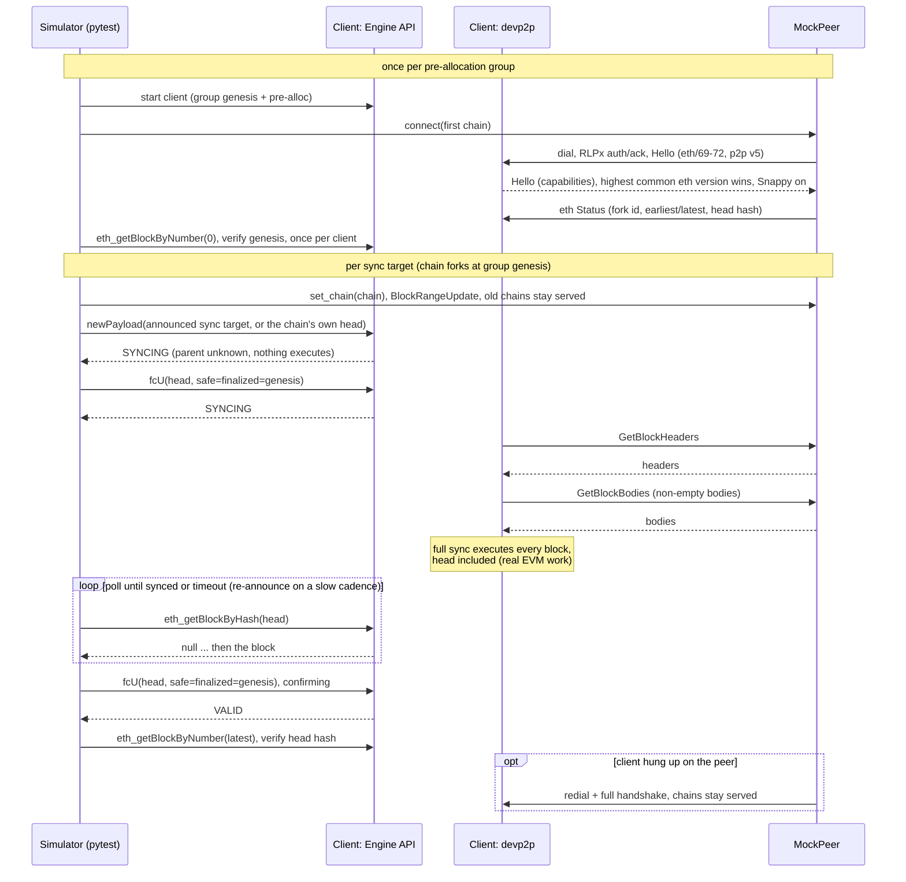

# Consume WireX

The WireX simulator (`eels/consume-wirex`) makes the client under test full sync each test's chain from a deterministic mock devp2p peer implemented inside the testing framework.

The goal is to check, using the consensus test corpus, that clients can download blocks from a peer over devp2p and execute them. It does not try to test every part of historical sync. WireX intends to replace [`consume rlp`](../running.md#rlp) for post-Merge forks: instead of a client-specific offline import at startup, the same blocks travel the client's production peer-to-peer path.

WireX consumes the [Blockchain Engine X Test](../test_formats/blockchain_test_engine_x.md) fixture format and reuses one client per pre-allocation group, like [`consume enginex`](../running.md#enginex). Each test is an independent chain forking at the group's genesis. Two things differ from EngineX:

- EngineX sends every block with `engine_newPayload`. WireX sends only the head it announces that way; the client downloads every block below it from the mock peer.
- EngineX resets the client to genesis with a forkchoice update before each test. WireX never resets the client between tests (see [The Control Plane and the Data Plane](#the-control-plane-and-the-data-plane)).

[Test Ordering and Client Reuse](#test-ordering-and-client-reuse) lists when WireX starts a fresh client instead of reusing the group's client.

## Quick Start

WireX runs against Hive in development mode, like the other consume simulators. See [Hive Development Mode](../hive/dev_mode.md) for setup.

1. Start Hive in development mode with one client:

    ```bash
    ./hive --dev --client go-ethereum --client-file clients.yaml
    ```

2. In another shell, point the simulator at Hive:

    ```bash
    export HIVE_SIMULATOR=http://127.0.0.1:3000
    ```

3. Fill Blockchain Engine X fixtures. `fill` writes this format only with `--generate-all-formats` (see [Generating All Fixture Formats](../../filling_tests/filling_tests_command_line.md#generating-all-fixture-formats)). A fixture release carries it only if it was filled with that flag; see [Consume Cache and Fixture Inputs](./cache.md) for using a release as `--input`.

    ```bash
    uv run fill --generate-all-formats --output=fixtures tests/prague/
    ```

4. Run WireX against the client:

    ```bash
    uv run consume wirex --input ./fixtures -n 4
    ```

`-n` sets the number of pytest-xdist workers. Use `--sim.limit` to select tests (see [Consume Cache and Fixture Inputs](./cache.md)). Fixtures without sync targets skip their single-block tests by default; see [Skipped Sync Targets](#skipped-sync-targets).

## Running WireX

```bash
uv run consume wirex [OPTIONS]
```

To see all options, run:

```bash
uv run consume wirex --help
```

The WireX options are:

| Option | Default | Described in |
| ------ | ------- | ------------ |
| `--wirex-bals` | `both` | [Block Access Lists](#block-access-lists) |
| `--wirex-min-blocks` | `2` | [Skipped Sync Targets](#skipped-sync-targets) |
| `--wirex-sync-timeout` | `60` (seconds) | [Tuning](#tuning) |
| `--wirex-sync-loop-interval` | the simulator's `HIVE_SYNC_LOOP_INTERVAL_MS`, else `10` (milliseconds) | [Tuning](#tuning) |
| `--wirex-announce-interval` | `3` (seconds) | [Process Diagram](#process-diagram) |
| `--wirex-poll-interval` | `0.005` (seconds) | [Process Diagram](#process-diagram) |
| `--wirex-eth-version` | `auto` | [The Mock Peer](#the-mock-peer) |
| `--wirex-no-sort-by-chain-length` | off | [Test Ordering and Client Reuse](#test-ordering-and-client-reuse) |

### Block Access Lists

Block access lists (BALs, EIP-7928) are requested over eth/71 (EIP-8159). `--wirex-bals` decides how the peer answers:

- `withhold` answers every entry as unavailable (the RLP empty string EIP-8159 prescribes), so a pass proves the client executed every block itself. The peer never leaves the request unanswered, since clients penalize a silent peer.
- `serve` answers from each block's payload, so a client that uses BALs to execute transactions in parallel takes that path. A pass in this mode does not show that the client executed the block itself, unless the client is known to execute blocks whose BALs it receives.
- `both`, the default, runs every Amsterdam-onward fixture once in each mode, each mode on its own client, so an Amsterdam-onward group boots two clients. nethermind runs `withhold` only: it requests BALs only for finalized blocks, and WireX finalizes only genesis, so its served tests would repeat the withheld ones. An explicit `--wirex-bals serve` still serves it.

An Amsterdam-onward test ID ends in the mode it ran under, `-bal_withheld` or `-bal_served` (for example `...[fork_Amsterdam-blockchain_test_engine_x]-go-ethereum_default-bal_withheld`). Every mode adds the suffix, a single-mode run included, so runs in different modes never share a test ID. Earlier forks carry no BAL, run once and take no suffix. `--wirex-bals withhold` halves the Amsterdam-onward work when the served path is not of interest.

### Skipped Sync Targets

A path is the chain from genesis up to one sync target (see [Sync Targets and Chain Classes](#sync-targets-and-chain-classes)). WireX skips a sync target when its path, target included, has fewer blocks than `--wirex-min-blocks` (default 2). The target itself arrives over the Engine API, so a one-block path would put nothing on devp2p.

A fixture without `syncPayloads` has its own last block as its only target. Each of its single-block tests is then a one-block path and is skipped by default, so a run on such fixtures can skip many tests. To run them anyway, pass `--wirex-min-blocks 1`; those tests then deliver their block over the Engine API only and check nothing on devp2p.

WireX also skips invalid paths that devp2p or the fixture cannot represent (see [Rejection Tests](#rejection-tests)). A fixture is skipped only when all of its sync targets are skipped. Otherwise it runs the rest and logs each skipped target on a line starting with `Omitting one of this fixture's`.

### Tuning

Run time depends on the client. Much of it goes to starting and stopping clients, and most of it for clients that boot slowly. A test that times out costs the full `--wirex-sync-timeout` (default 60 s), so a class of tests a client never answers can dominate a run. A lower timeout shortens such runs, but too low a value fails valid syncs of short chains.

- Parallelism: `-n 4` is a safe default. Each xdist worker and each running client needs its own memory. Groups run whole on one worker, so a run cannot finish faster than its largest group.
- Sync loop interval: some clients advance a sync only when a loop on a timer runs. nethermind's runs once a second by default, which makes each short test take seconds.
    - WireX asks every client for a 10 ms interval through the client environment variable `HIVE_SYNC_LOOP_INTERVAL_MS`. A client's Hive wrapper must map it to the client's own setting. nethermind's wrapper does so once [ethereum/hive#1621](https://github.com/ethereum/hive/pull/1621) is in your Hive build. Other clients ignore it.
    - To change the value, pass `--wirex-sync-loop-interval MS` or set `HIVE_SYNC_LOOP_INTERVAL_MS` for the simulator. `0` sends no hint.
    - A client that applies the hint runs with a non-default setting, so the run records the interval in the report header, the Hive suite description and each test's junit properties.
    - The first client of each type on each worker is checked, if it reports its configuration. If it ignored a value you set, the run stops. If it ignored the default, the run warns and continues.
- Timing data: `--timing-data` prints each test's phase timings and records them as a `timing_data` property of each test case in the junit report, also under `-n`.
- Leftover clients: a crashed xdist worker cannot stop its clients, and stopping Hive does not remove them, so check for leftover client containers (`docker ps`) after an interrupted run.

### Reading Results

- Log file: each run writes one log file per xdist worker to `./logs` (`--log-to` changes the directory). The session header and the final summary print its path. The same lines also go to stdout. `--eest-log-level` sets the level (default `INFO`).
- Hive: each test's result in Hive holds the failure message and the test's captured output, including its log lines.
- Peer transcript: most sync failures end with `Peer transcript:` followed by every request and response between the client and the mock peer during that test.
- `latestValidHash check:`: every rejection logs this line with the result of the check (see [Rejection Tests](#rejection-tests)).
- Client replacement: a warning names the reason and ends with `; replacing the client`. A multi-target fixture logs that it runs each target `on an isolated client` (see [Test Ordering and Client Reuse](#test-ordering-and-client-reuse)).

## How WireX Works

### The Control Plane and the Data Plane

A post-Merge client does not choose its own head; something must tell it what to sync to. WireX splits this deliberately:

- The control plane is the Engine API: one `engine_newPayload` carries the head block and one `engine_forkchoiceUpdated` names it. That is the entire non-devp2p surface of a test.
- The data plane is devp2p: the client downloads headers and bodies from the mock peer over RLPx and executes the blocks itself.

`engine_newPayload` for a block whose parent is unknown executes nothing; the client caches the header and answers `SYNCING`. So every block below the announced head is fetched from the peer and executed by the full sync path. Which block is announced depends on the fixture's [sync targets](#sync-targets-and-chain-classes).

There is deliberately no rewind between tests. Every chain forks at the group's genesis, so announcing the new head is all a consensus client would do; clients that honor a backward forkchoice update can enter recovery modes that bypass block execution.

### Process Diagram

The common single-target valid path is:


```mermaid
sequenceDiagram
    participant S as Simulator (pytest)
    participant E as Client: Engine API
    participant D as Client: devp2p
    participant P as MockPeer

    note over S,P: once per pre-allocation group
    S->>E: start client (group genesis + pre-alloc)
    S->>P: connect(first chain)
    P->>D: dial, RLPx auth/ack, Hello (eth/69-72, p2p v5)
    D-->>P: Hello (capabilities), highest common eth version wins, Snappy on
    P->>D: eth Status (fork id, earliest/latest, head hash)
    S->>E: eth_getBlockByNumber(0), verify genesis, once per client

    note over S,P: per sync target (chain forks at group genesis)
    S->>P: set_chain(chain), BlockRangeUpdate, old chains stay served
    S->>E: newPayload(announced sync target, or the chain's own head)
    E-->>S: SYNCING (parent unknown, nothing executes)
    S->>E: fcU(head, safe=finalized=genesis)
    E-->>S: SYNCING
    D->>P: GetBlockHeaders
    P-->>D: headers
    D->>P: GetBlockBodies (non-empty bodies)
    P-->>D: bodies
    note over D: full sync executes every block,<br/>head included (real EVM work)
    loop poll until synced or timeout (re-announce on a slow cadence)
        S->>E: eth_getBlockByHash(head)
        E-->>S: null ... then the block
    end
    S->>E: fcU(head, safe=finalized=genesis), confirming
    E-->>S: VALID
    S->>E: eth_getBlockByNumber(latest), verify head hash

    opt client hung up on the peer
        P->>D: redial + full handshake, chains stay served
    end
```

The simulator polls for the head block instead of repeating the forkchoice update, because in some clients every update restarts the sync cycle. It polls every `--wirex-poll-interval` (default 0.005 s), re-announces only on a slow cadence (`--wirex-announce-interval`, default 3 s) and reads each `engine_newPayload` answer: `INVALID` fails a valid path at once with the client's `validationError`. An Engine API call can block for a long time, so the head, or the verdict, is always read once more after the sync timeout before the test gives up.

### The Mock Peer

The peer lives in `execution_testing.devp2p`: an RLPx transport (ECIES handshake, frame MACs, Snappy compression, p2p v5) and the eth wire protocol, versions 69 to 72. The highest version both sides share wins and is recorded in each test's transcript; `--wirex-eth-version` pins one (the default, `auto`, lets negotiation pick), so a client that lacks it fails the handshake loudly.

The peer is deliberately honest: it never withholds, reorders or corrupts a response, so a sync failure is a finding about the client or the fixture, not the peer.

- Receipts requests are counted and left unanswered. A full syncing client derives receipts by executing blocks, so serving them would turn real failures into passes without coverage; a nonzero count is a finding.
- BALs are withheld or served per `--wirex-bals` (see [Block Access Lists](#block-access-lists)).
- Chains already served stay served, because a client's downloader keeps asking for the chain it was syncing when a test ended.
- Responses are bounded by serialized bytes (2 MiB), because clients drop a peer whose message exceeds their own cap.
- The peer redials a client that dropped it, checking at each re-announcement. It does not redial sooner: a client may accept a peer that reconnects within a fraction of a second and then never sync from it.
- Every request and response is recorded in a per-test transcript, which makes a stalled sync diagnosable afterwards.

### Sync Targets and Chain Classes

A fixture can carry an optional, ordered `syncPayloads` list: empty blocks that `fill` adds, one on top of the last block of each of the test's chains. Each of these blocks is a sync target, and a path is the chain from genesis up to one sync target. WireX runs one path for every target. Without the list, the fixture's own last block is the only target, so its path is the test's chain. This list is not the single `syncPayload` of the [Blockchain Sync Test](../test_formats/blockchain_test_sync.md) format.

Below, `G` is genesis, `T₁…Tₙ` the test's own blocks, `S` a sync target from `syncPayloads`, `*` the announced block, and `ᵢ` an intentionally invalid block:

| Fixture shape | Sequence | Targets | WireX behavior |
| ------------- | -------- | ------- | -------------- |
| Valid linear path | `G → T₁…Tₙ → S*` | one | all of the test's blocks are below `S` and covered by the per-hash wire assertion |
| Invalid linear path | `G → T₁…Tₙᵢ → S*` | one | the invalid block is below `S`; the rejection and per-hash wire coverage are asserted |
| Several chains | `G → (T₁ᵢ → S₁*) ⧸ (T₂ → S₂*)` and deeper shapes | several | each target selects one path from genesis and runs independently |
| Partial target list | one or more target paths | fewer targets than chains | listed targets run; a chain without a target has no WireX path of its own |
| Engine API error code | `G → T₁…Tₙ*` | none | the test's last block is announced and the declared RPC-layer refusal is asserted; no wire coverage is required |
| No targets | `G → T₁…Tₙ*` | none | the test's chain is the only path; valid paths assert wire coverage below the head, rejection paths do not |

Each target selects its path by hash alone: its `parentHash` names the last block of one of the test's chains, and the `parentHash` links of the test's blocks lead back to genesis. List position, timestamps and `lastblockhash` are never consulted. The target counts toward its path's length, so a single-block test plus its target is a two-block chain.

### Rejection Tests

A path containing an intentionally invalid block runs as a rejection case. Validity is decided over the path's own payloads, so a valid path beside an invalid sibling must still synchronize. The peer serves the path as is (`G → T₁…Tₙᵢ → S*`), so the invalid block is an ancestor the client fetches over devp2p, and once it has arrived the client must answer `INVALID` for the head. Only a `VALID` that holds for half a second counts as acceptance: a client answers from its state of that instant, so an early answer can be an artifact. A client that neither rejects nor accepts the head before `--wirex-sync-timeout` fails the test with `Client never rejected the invalid head`, the last status it gave (for example `SYNCING`) and the peer transcript.

With a sync target from `syncPayloads`, the verdict must also have been reached on the wire: the test runs the [wire coverage](#wire-coverage) check over everything below the head, the invalid block included. A chain without a target announces its own invalid head, which a client may judge from the announcement alone (from a header field, or because it already refused an ancestor), so WireX does not check wire coverage for such chains. A path whose declared invalidity is checkable in the header (currently `BlockException.INCORRECT_EXCESS_BLOB_GAS`) may be rejected during header validation, so WireX then checks only that every header arrived, not the bodies. This is decided per exception class, never per client.

Only the fact of rejection is asserted, never its cause: `validationError` is free-form client text and devp2p carries no reason at all. The client's reason is logged.

If an `INVALID` answer gives a `latestValidHash`, it must be the parent of the first invalid block on the path. Any other hash fails the test, so a client that blames a valid block fails. A null hash is accepted. The all-zero hash names a PoW ancestor, which here can only be genesis, so it passes only when genesis is the expected hash. An `INVALID_BLOCK_HASH` answer fails the test, since every served payload hashes to its `blockHash`. The log shows the result after `latestValidHash check:` as `match`, `null` (no hash given), `unchecked` (no block on the path is invalid, so there is no hash to match) or `mismatch` (the test fails).

A fixture that declares an Engine API error code for its head passes when the client refuses `engine_newPayload` with that code.

WireX skips an invalid path in two cases. A body that no conformant client can decode is a limit of devp2p: the client discards it instead of judging the block. A header that cannot be rebuilt from its payload is a limit of the fixture: WireX recomputes the commitments the payload does not carry (the transactions and withdrawals roots, the requests and BAL hashes), so a commitment modified at fill (via `rlp_modifier`) leaves no trace and the rebuilt header hashes differently.

A rejection below a reused client's head cannot be judged over devp2p, because the client refuses to walk its head backwards (it declines the announcement and never concludes), and handing the ancestry over the Engine API would take the verdict off the sync path. Such a test gets a fresh client, for which the whole chain is above the head (see [Test Ordering and Client Reuse](#test-ordering-and-client-reuse)).

### Test Ordering and Client Reuse

Tests inside each group run valid chains before invalid ones, each by ascending length of the longest path. Some clients stall when asked to sync a chain shorter than one they already synced, and serving a bad block can leave a client's sync machinery backing off and starve the next valid sync. The ordering also limits below-head rejection replacements to at most one per group. `--wirex-no-sort-by-chain-length` disables it, to reproduce those stalls or compare runs.

A group normally shares one client. WireX starts a fresh client instead in these cases:

- Several sync targets: each target of the fixture runs on its own fresh client and mock peer, torn down when the target completes, so one target's rejected branch cannot starve another. The group's client is not used, but the fixture still counts toward the group's completion, so the group's client stops on time.
- Rejection below the head: the invalid chain's head is below the reused client's head (see [Rejection Tests](#rejection-tests)).
- Deep reorg: the chain would reorg the reused client more than 64 blocks. A reused client syncs each new chain by reorging down to where it forks from the client's chain, usually genesis, but clients keep state only for their most recent blocks and cannot reorg below that from full sync alone. A chain that extends the head's ancestry does not count as a reorg.
- Head lookup failure: WireX cannot read the reused client's head.
- `--wirex-bals both`: each BAL mode has its own client (see [Block Access Lists](#block-access-lists)).

In the rejection, reorg and head lookup cases, the fresh client replaces the group's client for the rest of the group, and a warning names the reason (see [Reading Results](#reading-results)).

### Wire Coverage

A correct outcome is not enough: every valid sync, and every rejection path with a sync target from `syncPayloads`, also asserts per block hash that the blocks below the announced head arrived over devp2p. Each needs its header served by this peer, and its body too unless the body is empty (no transactions, no withdrawals). A failure names the missing blocks and includes the peer transcript. The head is exempt, since its payload arrives over the Engine API. A multi-target fixture is checked per path, against the client and peer that served it, so a sibling cannot vouch for another branch.

The evidence is cumulative per client: tests of one group may declare byte-identical blocks, which the reused client downloads only once, and the run logs when earlier service satisfied a test.

The peer records a response only after writing it, so a failed send never reads as service. A fast client can import the chain moments before the evidence lands, so a missing block is re-read until a short grace period has passed before it fails the test.

## Relationship to Other Simulators

|                        | `consume rlp`                       | `consume sync`                          | `consume wirex`                                    |
| ---------------------- | ----------------------------------- | --------------------------------------- | -------------------------------------------------- |
| Block delivery         | RLP files imported at startup       | devp2p, from a second client            | devp2p, from a framework-controlled mock peer      |
| Client code path       | Client-specific offline import      | Production sync path                    | Production sync path                               |
| Determinism            | Deterministic                       | Depends on the serving client           | Deterministic peer, transcripted                   |
| Clients per test       | One per fixture                     | Two per fixture                         | Reused group client; one isolated client per target for multi-target fixtures |
| Fork support           | All forks                           | Post-Merge only                         | Post-Merge only                                    |
| Invalid-block fixtures | Rejection implied by final head     | Rejected via Engine API, never synced   | Targeted paths travel devp2p; rejection asserted   |

`consume sync` validates client-to-client interoperability on a handful of fixtures; WireX runs the whole test corpus on post-Merge forks against a single deterministic peer. `consume rlp` remains the only simulator covering pre-Merge forks.
