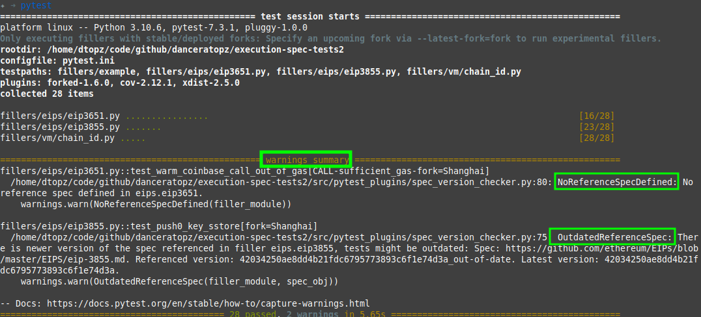

# Referencing an EIP Spec Version

An Ethereum Improvement Proposal (EIP) and its SHA digest can be directly referenced within a python test module in order to check whether the test implementation is out-dated. If the spec version changes, the test framework will issue a summary in its warning section.

<figure markdown>
 { width=auto align=center}
</figure>

## How to Add a Spec Version Check

This check accomplished by adding two global variables anywhere in the Python source file:

- `REFERENCE_SPEC_GIT_PATH`: The relative path of the EIP markdown file relative to the [ethereum/EIPs](https://github.com/ethereum/EIPs/) repository, e.g. "`EIPS/eip-1234.md`"
- `REFERENCE_SPEC_VERSION`: The SHA digest of the current version of the file, which can be obtained using the Github API and the following endpoint:
    ```
    https://api.github.com/repos/ethereum/EIPs/contents/EIPS/eip-<EIP Number>.md
    ```


## Example

Here is an example from [./fillers/eips/eip3651.py](../_auto_gen_fillers/EIPS/eip3651.md):

```python
REFERENCE_SPEC_GIT_PATH = "EIPS/eip-3651.md"
REFERENCE_SPEC_VERSION = "d94c694c6f12291bb6626669c3e8587eef3adff1"
```
The SHA digest was retrieved [here](https://api.github.com/repos/ethereum/EIPs/contents/EIPS/eip-3651.md).
